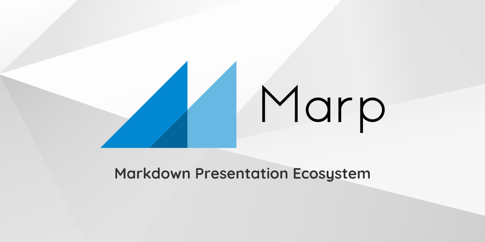

# Marp로 ppt 슬라이드 만들기


---
## 1. Marp for VS code 설치

 1) VS code 실행
 2) Extension에서 Marp 검색 후 설치
 3) 설치 끝!

---
## 2. 슬라이드 만들기

 - 구분자는 --- 입니다. 
 - 구분자 --- 를 넣고 marp: true 를 기입해주면 시작! 
 - 띄어쓰기 틀리지 말 것 
 - 글자 밑에 한 칸 안 띄어주면 슬라이드 안 나눠짐! 

 ---
 ## 3. 배경색 조정하기

     backgroundColor: 

 - 이걸 marp: true 랑 같이 기입해주면 배경색 조정가능함. 

     ex) backgroundColor: #FFFFF0

---
## 4. 이미지 넣기

 - Markdown에서 이미지 넣기랑 같음
 - Jupyter notebook에서 마크다운으로 이미지 넣는 방식과 같음
 - 안타까운 점은 이미지 위치 이동이 안됨 + 컨트롤 어려움

       




---
## 5. 배경화면 설정하기
    
     
      : 이미지를 슬라이드에 맞추기 


---
## 6. 코드 삽입하기

```python
def greet_function(sentence):
    if type(sentence) == str:
        print("Hello")
    else:
        print("Who are you?")
```

---
## 7. 테마 적용하기

 - Marp에서 제공하는 테마는 현재 2가지 존재 -> *'기본 테마가 아닌 다른 테마를 적용할 수 있지 않을까?'*
 - marp: true랑 같이 기입하면 됨
 - *theme: gaia* 를 사용하면 *_class: lead* 혹은 *class: lead* 로 Title **가운데 정렬 가능** 

        theme: default  
        theme: gaia 


---
## 8. 표 만들기 

|  | DH | SR | MH | SM |
| -- | -- | -- | -- | -- | 
| **Kill** | 10 | 3 | 1 | 0 |
| **Death** | 0 | 1 | 0 | 3 | 
| **Assists** | 6 | 5 | 17 | 1 | 


---
## 잡기술
### 1. 이미지 흐리게 만들기 


---
### 2. 흑백사진 만들기 


---
### 3. 색깔 반대로 바꾸기


---
### 4. 안에 있는 이미지만 바꾸기


---
### 5. 배경화면 여러 개 설정하기 


---
### 6. 배경화면 옆으로 치워버리기


---
### 7. 페이지 설정하기 

    paginate: true -> 모든 페이지 번호 표시됨   
    _paginate: false -> 첫 커버는 페이지 번호 표시 안 됨

---
### 8. 매 Slide마다 맨 위랑 아래에 주석 같이 달기
     header: '**쓰고싶은 말** _쓰고싶은 말_'
     footer: ''

--- 
### 9. 중간에 슬라이드 색 바꾸기 
     <!-- backgroundColor: orange -->

---
## References

[참고 1](https://gist.github.com/yhatt/a7d33a306a87ff634df7bb96aab058b5)
[참고 2](https://marpit.marp.app/)